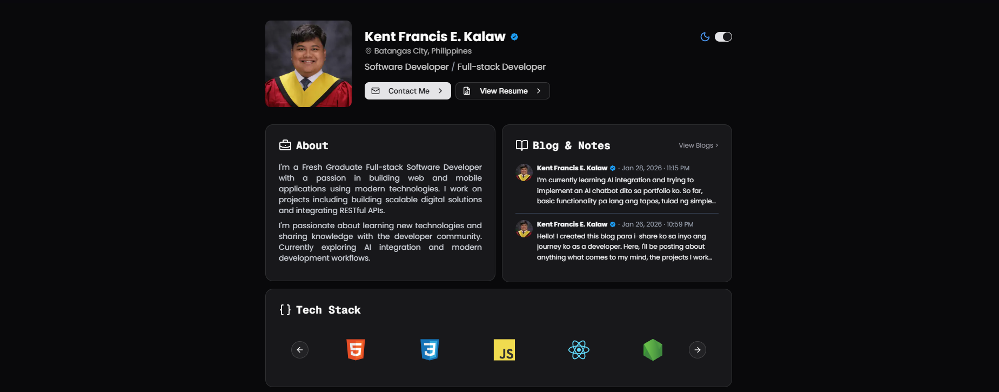

## Kent Francis E. Kalaw Portfolio - Software Developer

A modern, minimalistic, and responsive personal portfolio website created using Next.js.



## Features

- Built with Next.js 16 and React 19
- Styled with Tailwind CSS and shadcn/ui components
- Dark/Light mode with smooth transitions
- Fully responsive design
- GitHub contributions integration
- Blog section
- Contact form
- Smooth animations and transitions

- TBA (AI ChatBot integration)

## File Structure
```
├── public/               # Static assets
├── src/
│ ├── app/                # Next.js app directory
│ │ ├── api/              # API routes
│ │ ├── blogs/            # Blog pages
│ │ ├── globals.css       # Global styles
│ │ ├── layout.tsx        # Root layout
│ │ └── page.tsx          # Home page
│ ├── components/         # React components
│ │ ├── pages/            # Page sections
│ │ └── ui/               # UI components (shadcn)
│ └── lib/                # Utility functions and data
├── components.json       # shadcn/ui config
├── next.config.ts        # Next.js config
├── tailwind.config.ts    # Tailwind config
└── tsconfig.json         # TypeScript config
```
